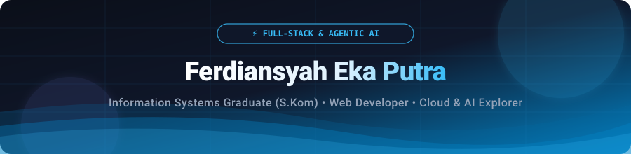

<div align="center">

  <!-- Header Banner -->
  

  <!-- Dynamic Typing Animation -->
  <a href="https://github.com/ferdiansyahep">
    
  </a>

  <br />

  <!-- Status & Info Badges -->
  <p align="center">
    
    &nbsp;
    
    &nbsp;
    <br />
    <br />
    
  </p>

  <!-- Quick Navigation -->
  <p align="center">
    <a href="#-about-me"><b>👨‍💻 About Me</b></a> •
    <a href="#-core-competencies"><b>⚡ What I Do</b></a> •
    <a href="#-current-focus--initiatives"><b>🚀 Focus Areas</b></a> •
    <a href="#️-tech-stack--arsenal"><b>🛠️ Tech Stack</b></a> •
    <a href="#-github-activity"><b>📊 Activity</b></a> •
    <a href="#-get-in-touch"><b>📬 Connect</b></a>
  </p>

</div>

---

### 👨‍💻 About Me

<p>
  Hi there! I'm <b>Ferdiansyah Eka Putra</b>, an <b>Information Systems Graduate (S.Kom)</b> from <b>Universitas Ahmad Dahlan (UAD)</b>, Yogyakarta, currently based in <b>Bogor, Indonesia</b>.
</p>

<p>
  I specialize in <b>Full-Stack Web Development</b>, <b>Agentic AI</b>, and <b>Cloud Engineering (GCP)</b>. I'm passionate about architecting scalable, modern web applications and engineering autonomous, tool-calling AI agent workflows that automate complex tasks.
</p>

- 🔭 **Primary Stack:** JavaScript / TypeScript, React, Next.js, Node.js, Python, and Google Cloud Platform (GCP).
- 🤖 **AI & Cloud Engineering:** Autonomous Agents, LLM Orchestration, Prompt Engineering & Cloud-native deployments.
- 🌱 **Continuous Growth:** Deepening expertise in Multi-Agent Frameworks, Microservices & Distributed Architectures.
- 💼 **Career:** Actively seeking full-time, contract, or freelance software & AI engineering opportunities.

```javascript
const developer = {
  name: "Ferdiansyah Eka Putra",
  degree: "S.Kom. in Information Systems",
  almaMater: "Universitas Ahmad Dahlan (UAD)",
  location: "Bogor, Indonesia 🇮🇩",
  specialties: ["Full-Stack", "Agentic AI", "Cloud / GCP"],
  techCore: ["Python", "JavaScript", "TypeScript", "React", "Node.js", "GCP"],
  aiFocus: ["Agentic AI", "LLM Orchestration", "Autonomous Workflows"],
  availability: "Open to opportunities 🚀",
};
```

---

### ⚡ Core Competencies

<div align="center">
  <table width="100%">
    <tr>
      <td width="33%" align="center" valign="top">
        <h3>🎨 Frontend Engineering</h3>
        <p>Developing pixel-perfect, accessible, and responsive web applications with smooth UX and cutting-edge frontend tooling.</p>
        <p><code>React</code> • <code>Next.js</code> • <code>TailwindCSS</code> • <code>TypeScript</code></p>
      </td>
      <td width="33%" align="center" valign="top">
        <h3>🤖 Agentic AI & Python</h3>
        <p>Designing autonomous AI agents, tool-calling pipelines, LLM workflow automation, and structured intelligent systems.</p>
        <p><code>Python</code> • <code>Agentic AI</code> • <code>Gemini AI</code> • <code>LLMs</code></p>
      </td>
      <td width="33%" align="center" valign="top">
        <h3>☁️ Backend & Cloud (GCP)</h3>
        <p>Architecting robust RESTful backends, database integrations, and cloud deployments on Google Cloud Platform.</p>
        <p><code>Google Cloud (GCP)</code> • <code>Node.js</code> • <code>Express</code> • <code>Databases</code></p>
      </td>
    </tr>
  </table>
</div>

---

### 🚀 Current Focus & Initiatives

<div align="center">
  <table width="100%">
    <tr>
      <td width="50%" valign="top">
        <h4>🌐 Full-Stack Modern Web Apps</h4>
        <p>Building production-grade web applications with modern architectures, clean state management, robust API layers, and fluid responsive design.</p>
      </td>
      <td width="50%" valign="top">
        <h4>🤖 Autonomous AI Agents & Workflows</h4>
        <p>Experimenting with agentic reasoning loops, tool integration, multi-agent collaboration, and automating complex task pipelines with LLMs.</p>
      </td>
    </tr>
  </table>
</div>

---

### 🛠️ Tech Stack & Arsenal

<div align="center">

| Category                | Technologies & Tools                                                                                                                                                                                                                  |
| :---------------------- | :------------------------------------------------------------------------------------------------------------------------------------------------------------------------------------------------------------------------------------ |
| **Languages**           | <a href="https://skillicons.dev"></a>                                                                                                        |
| **AI & Cloud**          | <a href="https://skillicons.dev"></a> <a href="https://skillicons.dev"></a> |
| **Frontend Frameworks** | <a href="https://skillicons.dev"></a>                                                                                           |
| **Backend & Runtime**   | <a href="https://skillicons.dev"></a>                                                                                                             |
| **Databases**           | <a href="https://skillicons.dev"></a>                                                                                                   |
| **Tools & Environment** | <a href="https://skillicons.dev"></a>                                                                                              |

</div>

---

### 📊 GitHub Activity

<div align="center">
  
</div>

---

### 📬 Get in Touch

<div align="center">

  <p>
    Whether you have an opportunity, an AI/web project to collaborate on, or just want to chat about tech — feel free to reach out!
  </p>

  <p>
    <a href="https://id.linkedin.com/in/ferdiep" target="_blank">
      
    </a>
    &nbsp;
    <a href="mailto:ferdiansyah.chimon24@gmail.com" target="_blank">
      
    </a>
    &nbsp;
    <a href="https://www.instagram.com/ferdi.ep" target="_blank">
      
    </a>
    &nbsp;
    <a href="https://github.com/ferdiansyahep" target="_blank">
      
    </a>
  </p>

  <br />

  <!-- Footer Banner -->
  

  <p>
    <b>Let's build something remarkable together!</b><br />
    <sub>Designed & Built by <a href="https://github.com/ferdiansyahep">Ferdiansyah Eka Putra</a></sub>
  </p>
</div>
